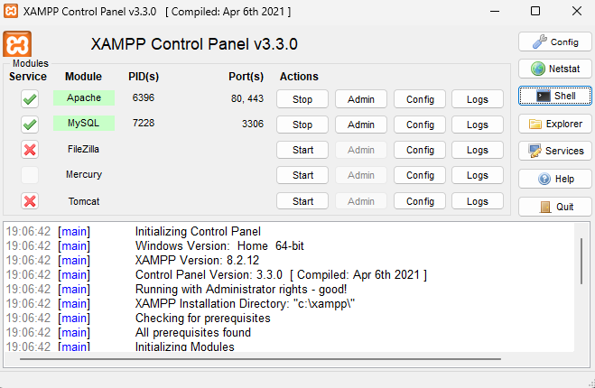
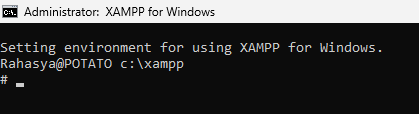
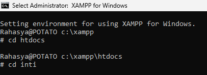
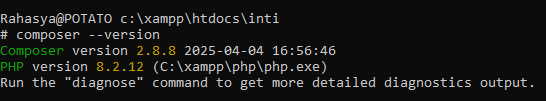
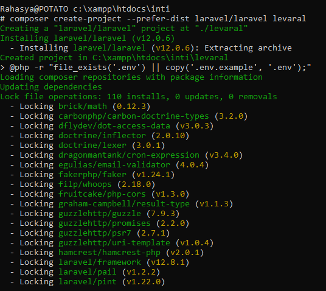
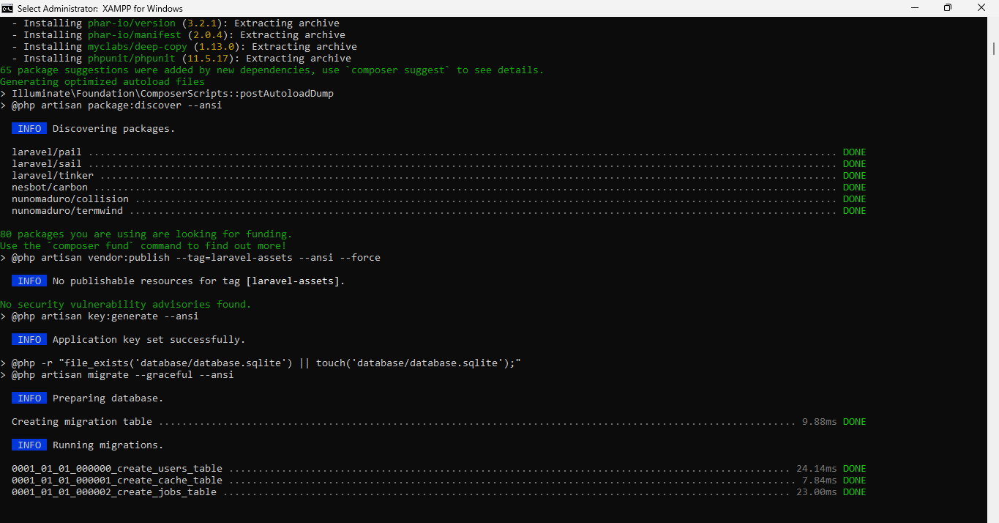
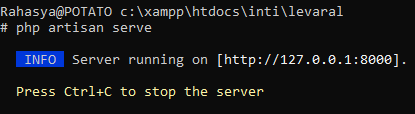
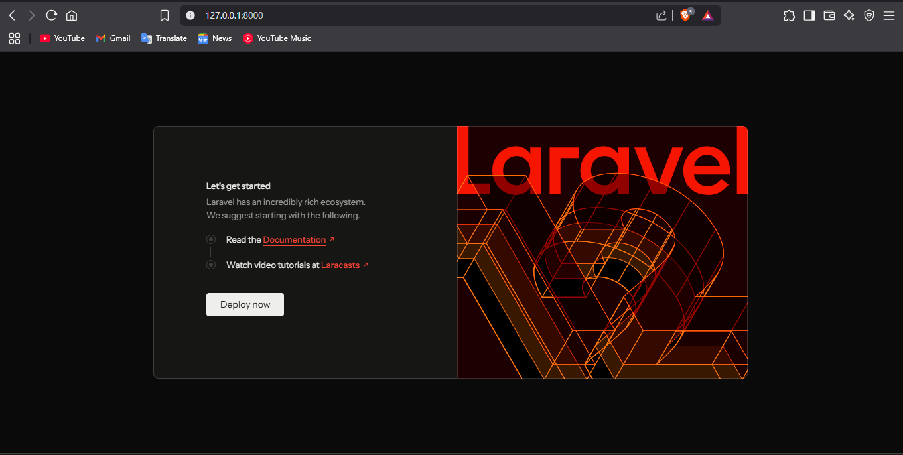

# 🚀 Dokumentasi Instalasi Laravel Menggunakan XAMPP Shell

Dokumentasi ini menjelaskan langkah-langkah menginstal Laravel melalui terminal bawaan XAMPP (Shell), mulai dari mengaktifkan Apache dan MySQL hingga menjalankan Laravel di browser lokal.

---

## 📌 Langkah 1: Menyalakan Apache dan MySQL di XAMPP

1. Buka aplikasi XAMPP.
2. Klik tombol **Start** pada modul **Apache** dan **MySQL**.
3. Pastikan statusnya berubah menjadi hijau yang menandakan sudah aktif.




---

## 📌 Langkah 2: Buka Shell di XAMPP

Klik tombol **Shell** di control panel XAMPP. Shell ini akan membuka terminal yang langsung berada di direktori:


```
C:\xampp
```




---

## 📌 Langkah 3: Arahkan ke Direktori `htdocs`

Ketik perintah berikut di shell untuk masuk ke folder `htdocs`:

```bash
cd htdocs
```

---

## 📌 Langkah 4: Masuk ke Folder Proyek (contoh: `inti`)

Saya telah membuat folder bernama `inti` di dalam `htdocs`. Maka arahkan terminal ke folder tersebut:

```bash
cd inti
```




---

## 📌 Langkah 5: Cek Apakah Composer Sudah Terinstal

Ketik perintah berikut untuk mengecek versi Composer:

```bash
composer --version
```

Jika Composer sudah terinstal, akan muncul versinya seperti:
```
Composer version 2.7.1 2024-03-15 10:00:00
```

Jika belum terinstal, silakan download dan install Composer terlebih dahulu dari website resmi berikut:

🔗 [https://getcomposer.org/download/](https://getcomposer.org/download/)




---

## 📌 Langkah 6: Install Laravel

Gunakan perintah berikut untuk mengunduh dan menginstal Laravel:

```bash
composer create-project --prefer-dist laravel/laravel levaral
```

> `levaral` adalah nama folder proyek Laravel kamu. Gantilah sesuai kebutuhan.

Tunggu hingga proses instalasi selesai. Ini akan memakan waktu tergantung kecepatan internet.




---

## 📌 Langkah 7: Masuk ke Folder Proyek Laravel

Setelah instalasi selesai, masuk ke folder Laravel:

```bash
cd levaral
```


---

## 📌 Langkah 8: Jalankan Laravel

Jalankan perintah berikut untuk menjalankan Laravel:

```bash
php artisan serve
```

Jika berhasil, akan muncul URL seperti:

```
Starting Laravel development server: http://127.0.0.1:8000
```




---

## 📌 Langkah 9: Buka Laravel di Browser

Buka browser dan akses URL berikut:

```
http://127.0.0.1:8000
```

Jika berhasil, akan tampil halaman default Laravel.




---

## 🎉 Instalasi Berhasil!

Selamat! Kamu telah berhasil menginstal dan menjalankan Laravel melalui terminal XAMPP.

---

## 📎 Referensi

- [Laravel Official Website](https://laravel.com/)
- [Composer Download Page](https://getcomposer.org/download/)
